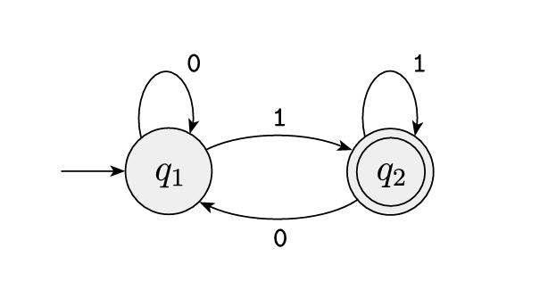

<!-- pandoc -t slidy -s notes/03-nfa.md -o slides/05-nfas.html --webtex -->

# Nondeterministic Finite Automata

## Determinism

"When a machine is in a given state and reads the next input symbol, we know what the next state will be--it is *determined*." [^sipser]

## Nondeterminism

* "A state is not uniquely determined by its current state." - Kozen [^kozen]

* "...the power to be in several states at once." - Hopcroft et al.[^hopcroft]

* "...several  choices may exist for the next state at any point." - Sipser [^sipser]

## Why???

- Represents real-life situations where there's not enough/incomplete/unpredictable/unreliable information about external forces and how they impact the state.

- Can be a useful tool in computation. Some algorithms rely on nondeterminism for more efficient solutions.

- Nondeterministic definitions can be simpler/more concise.

## Nondeterministic Finite Automata

A Nondeterministic Finite Automaton (NFA) has a similar 5-tuple definition as the Deterministic Finite Automata (DFA) we've seen so far: $(Q, \Sigma, \delta, s, F)$, but some components are defined differently.

Thinking of our 5-tuple definition and the definition of nondeterminism, what components do you think are different?

## Nondeterministic Finite Automata

We still have:

- $Q$: A finite set of states 
- $\Sigma$: A finite alphabet
- $F \subseteq Q$: A set of accept states

But we can have

- a *set* of start states!

- $\delta$ can transition to a *set* of possible next-states! You also don't *have* to have a transition defined for every state, input combination! 

## Nondeterministic Finite Automata - Formal Definition

A *nondeterministic finite automaton* (NFA) is a five-tuple:

$$N = (Q, \Sigma, \Delta, S, F)$$ 

where

- $Q$: A finite set of states 
- $\Sigma$: A finite alphabet
- $\Delta$: a function $Q \times \Sigma \to 2^Q$
- $S \subseteq Q$: A *set* of start states
- $F \subseteq Q$: A set of accept states

Where $2^Q$ is the *power set* of $Q$. ($\{A \mid A \subseteq Q\}$)

## Example

Draw an NFA over the alphabet $\{a,b\}$ such that it accepts:

$$A = \{w \in \{a,b\}^* \mid \textrm{the last symbol is } a \}$$

E.g. it accepts $ababba$ and $aaa$ but not $aab$ or $babab$.

## Another feature: Epsilon Transitions

* $\epsilon$-transitions can be useful in simplifying representation of a diagram. 

* Essentially, they give us transitions over *no* input (aka the empty string $\epsilon$)

<!-- * In this example, you'll see that they are helpful in handling the beginning and end of an input, which is where I intend to use them in this course. -->

## Another example 
Draw an NFA over the alphabet $\{a,b\}$ such that it accepts:

$$A = \{w \in \{a,b\}^* \mid w \textrm{has } 2m \textrm{ or } 3m \textrm{ } a's \}$$

## What does "acceptance" mean?

<!-- - "An NFA accepts a string $w$ if it is possible to make any sequence of choices of next state, while reading the characters of $w$, and go from the start state to any accepting state." - Hopcroft et al. [^hopcroft] -->

A nondeterministic automaton is said to *accept* its input $w$ if there exists *at least* one computation path on input $w$ from a start state to an accept state.

## Some properties

* Every DFA can be expressed as an NFA. (Reasonable.)

* Every NFA can be expressed as a DFA. (A little more complicated to think about...)

## Every DFA can be expressed as an NFA

Let's take an example DFA from a previous class...

[^sipser]

## Every NFA can be expressed as an DFA

Let's use our earlier example of our NFA that accepts

$$A = \{w \in \{a,b\}^* \mid \textrm{the last symbol is } a \}$$

## Basic Procedure

To convert NFA $N = (Q_N, \Sigma, \Delta_N, S_N, F_N)$ to DFA $M = (Q_M, \Sigma, \delta_M, s_M, F_M)$,

From a high-level: Set the states of $M$ to be the *powerset* of the states of $N$, and follow the rest of the construction logically from there.

Formally:

* $Q_M = 2^{Q_N}$
* $\delta_M(A,a) = \bigcup_{q \in A}\Delta_N(q,a)$
* $s_M = S_N$
* $F_M = \{A \subseteq Q_N | A \cap F_N \neq \emptyset\}$

# Sources

[^hopcroft]: - Hopcroft, John E., Rajeev Motwani, and Jeffrey D. Ullman. "Introduction to automata theory, languages, and computation." Acm Sigact News 32.1 (2001): 60-65.

[^kozen]: - Kozen, Dexter C. Automata and computability. Springer Science & Business Media, 2007.

[^sipser]: - Sipser, Michael. "Introduction to the Theory of Computation." ACM Sigact News 27.1 (1996): 27-29