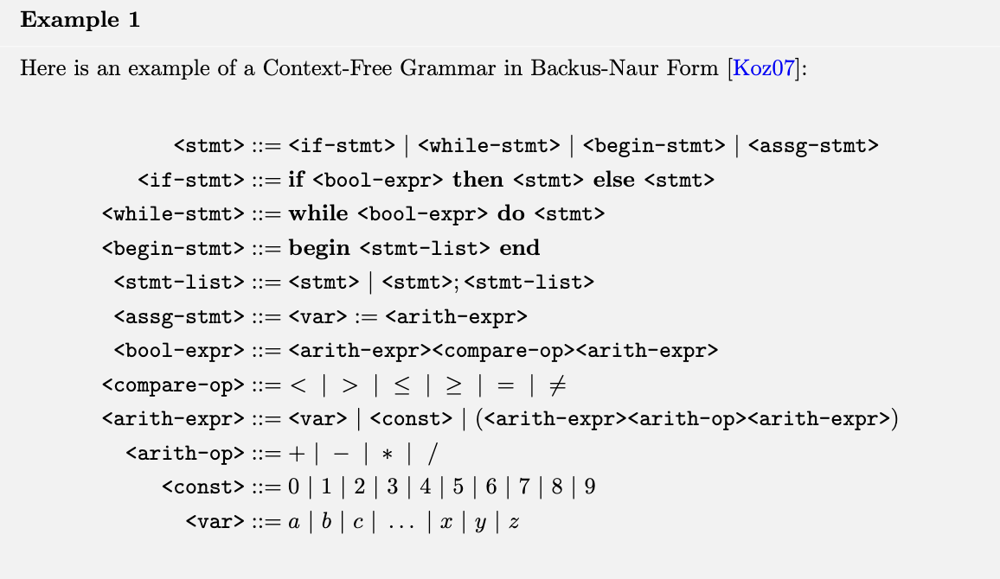
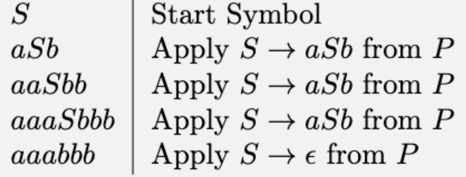

<!-- pandoc -t slidy -s notes/05-cfgs.md -o slides/05-CFGs.html --webtex -->

# Context-Free Grammars + Languages

## CFGs and CFLs

* Just as regular expressions describe regular languages, **context-free grammars describe context-free languages.** 

* The "class" of Context-Free Languages *contains* the set of Regular Languages.

* CFLs are good for describing infinite sets of  strings in a finite way. They are commonly used for describing the syntax programming languages.

## CFG Example

## Context Free Grammar Definition

A context-free grammar (CFG) is a quadruple

$$G = (N, \Sigma, P, S)$$

where 

* $N$ is a finite set (the *nonterminal* symbols or *variables*)
* $\Sigma$ is a finite set (the *terminal* symbols) dijoint from $N$
* $P$ is a finite subset of $N \times (N \cup \Sigma)^*$ (the *productions* or *rules*), and
* $S \in N$ (the *start symbol*) 

## Common Conventions

Typically, 

* nonterminals are denoted with capital letters (e.g. $A, B, \ldots$)

* terminals are denoted with lowercase letters (e.g. $a,b, \ldots$) 

* strings in $(N \cup \Sigma)^*$ are denoted using greek letters (e.g. $\alpha, \beta, \gamma, \ldots$)

## Common Conventions

Typically, 

* nonterminals are denoted with capital letters (e.g. $A, B, \ldots$)

* terminals are denoted with lowercase letters (e.g. $a,b, \ldots$) 

* strings in $(N \cup \Sigma)^*$ are denoted using greek letters (e.g. $\alpha, \beta, \gamma, \ldots$)

Think of productions/rules kind of like transitions. Instead of a tuple representation like $(A, \alpha)$, they often have an arrow representation $A \rightarrow \alpha$. 

To denote a set of productions with the same left-hand side, instead of listing them 

$A \rightarrow \alpha_1$, $A \rightarrow \alpha_2$, $A \rightarrow \alpha_3$

You use the abbreviation

$A \rightarrow \alpha_1  \mid  \alpha_2  \mid  \alpha_3$

## $a^nb^n$

The nonregular set $\{a^nb^n  \mid n \geq 0 \}$ can be represented  as a CFL 

$S \rightarrow aSb  \mid \epsilon$

More specifically, in quadruple form: 
$G = (N, \Sigma, P, S)$, where

    
* $N = \{S\}$
* $\Sigma = \{a,b\}$
* $P = \{S \rightarrow aSb, S \rightarrow \epsilon \}$
    
## $a^nb^n$

Here's how you would derive the string $a^3b^3$ or $aaabbb$:

The more common way to write this is:

    

$S \xrightarrow[G]{1} aSb \xrightarrow[G]{1} aaSbb \xrightarrow[G]{1} aaaSbbb \xrightarrow[G]{1} aaabbb$

    
Or
    
$S \xrightarrow[G]{4} aaabbb$
    

In English you'd say ``This string is derivable from the start symbol in 4 steps.''

## Sentential Form + Sentence

A string in $(N \cup \Sigma)^*$ derivable from the start symbol $S$ is called a *sentential form*. 

A sentential form is called a *sentence* if it consists only of terminal symbols.  

(In other words, a sentence would be in $\Sigma^*$.)

## Derivable Strings

As we showed in the example, 

* $\alpha \xrightarrow[G]{1} \beta$ if $\beta$ can be derived from $\alpha$ over one step in the grammar $G$.
* $\alpha \xrightarrow[G]{n} \beta$ if $\beta$ can be derived from $\alpha$ over $n$ steps in the grammar $G$.

Moreover

* $\alpha \xrightarrow[G]{*} \beta$ if $\alpha \xrightarrow[G]{n} \beta$ for some $n \geq 0$

## The Language of a Grammar

This allows us to define the *language* of a grammar in the following way:

The *language of the grammar* $G$ is $\{w \in \Sigma^*  \mid S \xrightarrow[G]{*}w\}$

## Converting a DFA into a CFG

There is an easy step-by-step way to convert a DFA $M=(Q,\Sigma,\delta,s,F)$ into a CFG:

* For each $q_i \in Q$, make a nonterminal $R_i$
* For all transitions $\delta(q_i, x) = q_j$, add the rule $R_i \rightarrow xR_j$
* If $q_i$ is an accept state, add the rule $R_i \rightarrow \epsilon$
* If $q_0$ is the start state of the machine, make $R_0$ the start variable.

