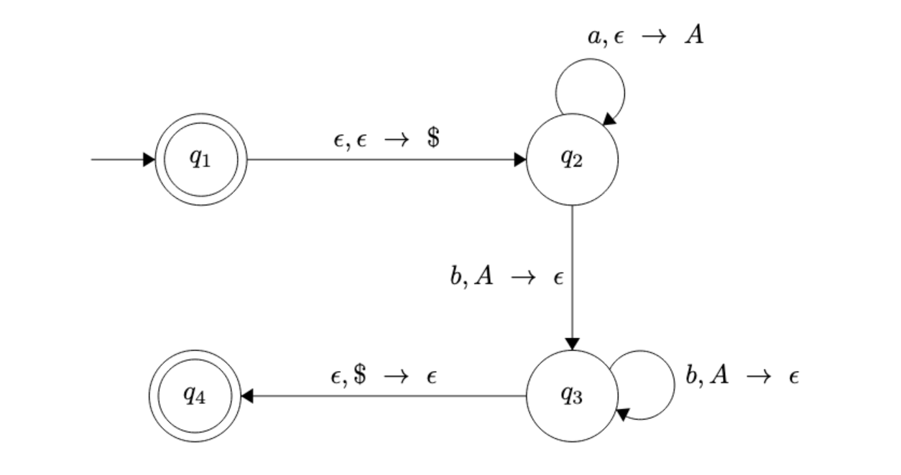

<!-- pandoc -t slidy -s notes/06-pda.md -o slides/pdas.html --webtex -->

# Pushdown Automata

## Pushdown Automata

DFAs/NFAs are computational models that recognize regular languages. 

Similarly *pushdown automata* are computational models that recognize context-free languages.

## Thinking of Finite Automata Differently

First, let's think about DFAs/NFAs a little differently using this representation:

 
* The control represents the states and transition function, 
* the tape contains the input string, 
* and the arrow represents the input head, pointing at the next input symbol to be read. 

## Pushdown Automata

A pushdown automaton is similar in its design, but it includes a *stack* where the automaton can write symbols to read back later. 

Every time a new symbol is written to the stack, the other symbols are *pushed down*.

(Recall that adding an element to a stack is called *pushing* an element and removing one is called *popping*!)

This design allows us to track things! You can recall that this was a limitation for finite automata, and was the reason they couldn't be used to represent sets such as $\{a^nb^n | n \geq 0\}$.

## Using a PDA to Recognize $a^nb^n$ 

Abstractly, we can think of a strategy to use the stack to "track" that we have the same amount of $a$s and $b$s.

Every time an $a$ is encountered, push an $A$ counter onto the stack. For every $b$ input encountered, pop an $A$ counter off the stack. At the end of the input string, the stack should be empty.

## Pushdown Automaton

    
A *pushdown automaton* is a 6-tuple $(Q, \Sigma, \Gamma, \delta, s, F)$ where

    
* $Q$ is the set of states
* $\Sigma$ is the the input alphabet
* $\Gamma$ is the stack alphabet
* $\delta: Q \times \Sigma_\epsilon \times \Gamma_\epsilon \to \mathcal{P}(Q \times \Gamma_\epsilon)$
* $s \in Q$ is the start state
* $F \subseteq Q$ is the set of accept states
    

Where $\Sigma \cup \{\epsilon\}$ be denoted as $\Sigma_\epsilon$ and $\Gamma \cup \{\epsilon\}$ be denoted as $\Gamma_\epsilon$

and $\mathcal{P}(Q \times \Gamma_\epsilon)$ is the powerset of $\mathcal{P}(Q \times \Gamma_\epsilon)$ (aka all possible subsets of $Q \times \Gamma_\epsilon$).

## Using a PDA to Recognize $a^nb^n$ (continued)

Now, we will demonstrate how to formally define the PDA that recognizes $\{a^nb^n | n \geq 0\}$

<!--  -->

## Formally Defining It

Define our PDA as $(Q, \Sigma, \Gamma, \delta, s, F)$ where: 

* $Q = \{q_1, q_2, q_3, q_4\}$
* $\Sigma = \{a,b\}$ 
* $\Gamma = \{A, \$ \}$ 
* $s = q_1$
* $F = \{q_1, q_4\}$ 
    

## Testing for the End of The Input

The way we've discussed acceptance of an input hasn't required knowing where the *end* of an input is. 

For this example, we need to know both when the input is finished (aka we've transitioned over every input character) and when the stack is empty (because that tells us we've seen the same amount of $a$s and $b$s). 

In terms of knowing when we reach the end of the input, we essentially use an $\epsilon$-transition to an accept state to denote we've reached the end of the input tape. 

## Testing for an Empty Stack

To know when the stack is empty, we place that $\$$ in the stack at the beginning. Since a stack is "last in first out", we know that when we see the $\$$ again, we have removed every other item from the stack.

We use an $\epsilon$-transition from our start state $q_1$ to $q_2$ to allow us to initalize that $\$$ element in the stack. 

<!-- Another common convention is to *not* use $\epsilon$-transitions but instead to just add a ``starting stack symbol'' to the tuple definition, making it a 7-tuple. For this class, let's stick the the former convention of always starting with an empty stack.  -->

## Acceptance to a PDA

A PDA $M=(Q, \Sigma, \Gamma, \delta, s, F)$ *accepts* input $w = w_1w_2\ldots w_m$, $w_i \in \Sigma_\epsilon$ 
if sequences of states 
$r_0,r_1,\ldots,r_m \in Q$ and strings $s_0,s_1,\ldots,s_m \in \Gamma^*$ exist that satisfy the following three conditions:

* $r_0 = s$ and $s_0 = \epsilon$ ($M$ starts out in the start state with an empty stack.)
* For $i = 0, \ldots, m-1$,  
    $(r_{i+1}, b) \in \delta(r_i, w_{i+1}, a)$,
    $s_i= at$, and  
     $s_{i+1} = bt$ for $a, b \in \Gamma_\epsilon$ $t \in \Gamma^*$.  
     (Given this input string, $M$ moves as expected over both the states and the stack.)
* $r_m \in F$ ($M$ ends in an accept state.)

## Theorem 

A language is context free if and only if some pushdown automaton recognizes it. 

## Converting a CFG to a PDA

1. Place the marker symbol \$ and the start variable on the stack.
2. Repeat the following steps:
    a. If the top element in the stack is a variable symbol (e.g. $A$), nondeterministically select one of the rules for $A$ and substitute $A$ by applying this rule. Push that new substution onto the stack.
    b. If the top element in the stack is a terminal symbol (e.g. $a$), read the next symbol from the input to see if it matches $a$. If they match, continue. Otherwise, consider this a reject and try another "branch" of nondeterminism. (Apply a different rule in the previous step.)
    c. If the top of the stack is \$, this means the stack is empty, so transition to the accept state. If the input has all be read, that means that the string is accepted.

