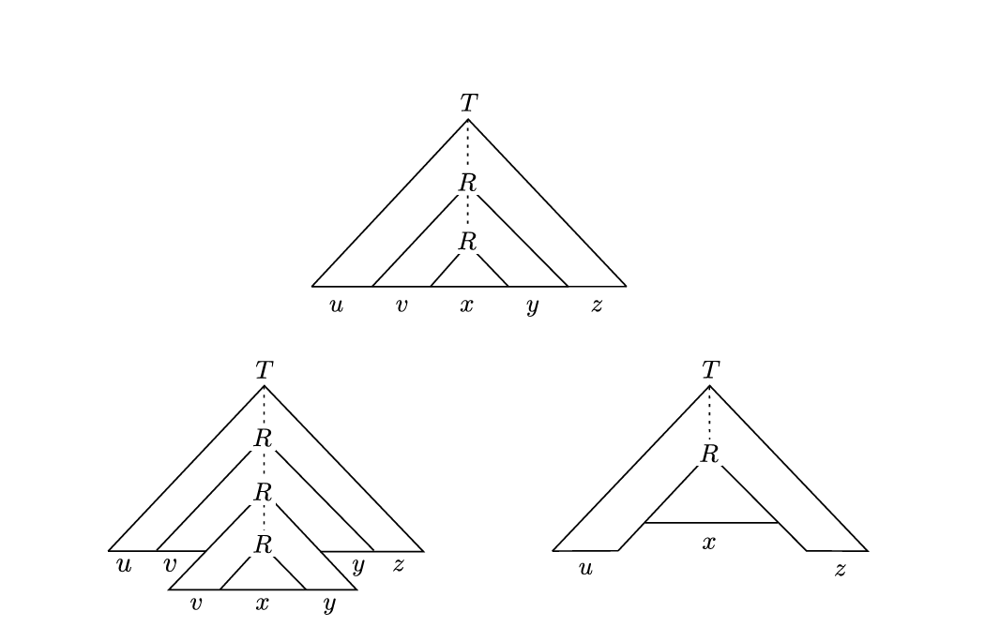

<!-- pandoc -t slidy -s notes/07-cfgs-pdas.md -o slides/07-cfgs-pdas.html --webtex -->

## Recap:Context Free Grammar 

A context-free grammar (CFG) is a quadruple

$$G = (N, \Sigma, P, S)$$

where 

* $N$ is a finite set (the *nonterminal* symbols or *variables*)
* $\Sigma$ is a finite set (the *terminal* symbols) dijoint from $N$
* $P$ is a finite subset of $N \times (N \cup \Sigma)^*$ (the *productions* or *rules*), and
* $S \in N$ (the *start symbol*) 

## Recap: Pushdown Automata

    
A *pushdown automaton* is a 6-tuple $(Q, \Sigma, \Gamma, \delta, s, F)$ where

    
* $Q$ is the set of states
* $\Sigma$ is the the input alphabet
* $\Gamma$ is the stack alphabet
* $\delta: Q \times \Sigma_\epsilon \times \Gamma_\epsilon \to \mathcal{P}(Q \times \Gamma_\epsilon)$
* $s \in Q$ is the start state
* $F \subseteq Q$ is the set of accept states

## Theorem 

A language is context free if and only if some pushdown automaton recognizes it. 

## Proof 

(In one direction)

## Converting a CFG to a PDA

1. Place the marker symbol \$ and the start variable on the stack.
2. Repeat the following steps:
    a. If the top element in the stack is a variable symbol (e.g. $A$), nondeterministically select one of the rules for $A$ and substitute $A$ by applying this rule. Push that new substution onto the stack.
    b. If the top element in the stack is a terminal symbol (e.g. $a$), read the next symbol from the input to see if it matches $a$. If they match, continue. Otherwise, consider this a reject and try another "branch" of nondeterminism. (Apply a different rule in the previous step.)
    c. If the top of the stack is \$, this means the stack is empty, so transition to the accept state. If the input has all be read, that means that the string is accepted.

## Non-Context Free Languages + The Pumping Lemma

Can use a modified version of the pumping lemma to prove a language is not context free:

If $A$ is a context-free language, then there is a number $p$ (the pumping length) where, if $s$ is any string in $A$ of length $\geq p$, then $s$ may be divided into $s = uvxyz$ satisfying these conditions:

* $|vy| > 0$ (at least one of $v$ or $y$ is not the empty string $\epsilon$)
* $|vxy| \leq p$
* for each $i \geq 0$, $uv^ixy^iz \in A$

## Example: $a^nb^nc^n$
