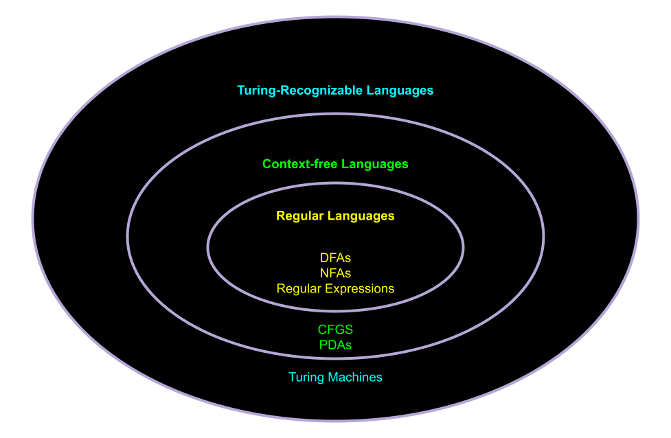
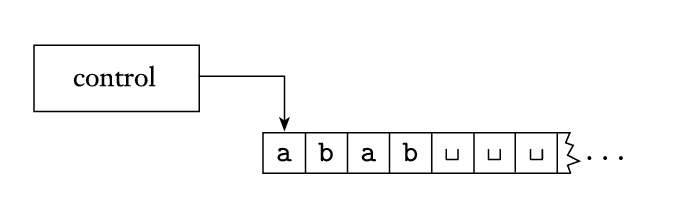

<!-- pandoc -t slidy -s notes/08-turing-machines.md -o slides/08-turing-machines.html --webtex -->

# Turing Machines

## Turing Machines

The final and *most powerful* computational model we will discuss

## Turing Machines: General Design

[^sipser]

* Initially, tape contains only the input string (blank otherwise)
* The machine can read + write information on the tape
* Machine continues until it reaches an *accept* or *reject* state
* The tape is considered *infinite*

## Tuple Definition

A *Turing machine* is a 7-tuple, $(Q, \Sigma, \Gamma, \delta, s, q_accept, q_reject)$

* $Q$ is the set of states
* $\Sigma$ is the input alphabet (not containing the *blank symbol* $\texttt{\verbvisiblespace}$)
* $\Gamma$ is the tape alphabet, where $\texttt{\verbvisiblespace} \in \Gamma$ and $\Sigma \subseteq \Gamma$
* $\delta: Q \times \Gamma \to Q \times \Gamma \times \{L,R\}$ is the transition function
* $s \in Q$ is the start state
* $q_{accept} \in Q$ is the accept state
* $q_{reject} \in Q$ is the reject state

## Configurations

The *configuration* of the Turing Machine is the current state, tape contents, and head location.

It is represented as $u q v$ where $q$ is the current state and $uv$ are the current contents of the tape, with the first character of $v$ being the current head location.

The *start configuration* on input $w$ would be $sw$.

The *accepting configuration* is the configuration the state it contains is $q_{accept}$ 

and the *rejecting configuration* is the configuration the state it contains is $q_{reject}$

A Turing machine $M$ *accepts* input $w$ if there are a sequence of configurations that begin at the start configurations and finish in an accepting configuration.

## Example: 

Let's define a Turing Machine that recognizes $A = \{0^{2^n}| n \geq 0\}$, the language containing all strings of $0$s that have length of $2^n$.

The basic idea is to repeatedly "divide" the input in half, hopefully finally getting to an input of length $1$.

Steps:

1. If the tape contains a single $0$, accept.
2. If the tape contains more than one $0$, but an odd number of $0$s, reject. 
3. Move left to right across the tape, crossing off every other 0.
4. Return the tape head to the left-hand end of the tape and repeat the previous steps.

## Another Example:

Let's define a Turing Machine that recognizes $B  = \{w\#w \mid w \in \{0,1\}^*\}$.

The basic idea is to "jump" to the corresponsing locations for each character in $w$ on either side of the $\#$ symbol.

Steps:

1. Move accross the tape to corresponding positions on either side of the $\#$ symbol. 
    * If both positions contain the same symbol, cross off the symbols.
    * If both positions do *not* contain the same symbol, reject.
2. Repeat until all symbols to the left of $\#$ have been crossed off. After that:
    * If there are any remaining symbols to the right of $\#$, reject
    * Else, accept

## Languages

We call a language *Turing-recognizable* if some Turing machine recognizes it.

We call a language *Turing-decidable* (or just *decidable*) if some Turing machine decides it.

Question: Are all Turing-recognizable languages Turing-decidable?

## Variants of Turing Machines

* There are many variants of Turing machines, including versions with multiple tapes and/or nondeterminism. 

* These variants all have the same power as the model described in this lesson, in the sense that all of them recognize the same class of languages.

## Resources

[^sipser]: Sipser, Michael. "Introduction to the Theory of Computation." ACM Sigact News 27.1 (1996): 27-29.

