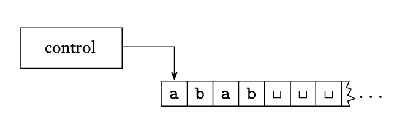

<!-- pandoc -t slidy -s notes/09-decidability.md -o slides/09-algs-decidability.html --webtex -->

## Algorithms

### Question: How would you define an algorithm?

## Motivation

What are the *roots* of $6x^3yz^2 + 3xy^2 - x^3 - 10$?

In other words, can we find values for $x$, $y$, and $z$ such that

$6x^3yz^2 + 3xy^2 - x^3 - 10 = 0$?

## Motivation

What are the *roots* of $6x^3yz^2 + 3xy^2 - x^3 - 10$?

In other words, can we find values for $x$, $y$, and $z$ such that

$6x^3yz^2 + 3xy^2 - x^3 - 10 = 0$?

(Yes: $x=5$, $y=3$, $z=0$.)

Is there an *algorithm* that can solve this for any polynomial?

## Defining an Algorithm: The Church-Turing Thesis

In 1936, algorithms were concurrently defined in two different ways!

* Alonzo Church: Expressed using $\lambda$-calculus

* Alan Turing: Expressed using Turing machines

Both representations are considered equivalent.

## An Algorithm for a Turing Machine

To express an algorithm using a Turing machine, we do the following:

1. Represent the problem we want to solve as a set/language.

2. Define a turing machine that *decides* it. (The "algorithm" is essentially the design of your machine.)

## Recall

[^sipser]

* In a Turing Machine, the tape is considered *infinite*.

* For a language $L$ on machine $M$,
    * Turing-recognizable:
        - Accepts if the input is in $L$
        - Rejects *or* loops forever if the input is not in $L$
    * Turing-decidable:
        - Accepts if the input is in $L$
        - Rejects if the input is not in $L$
    

## Recall: An Example Algorithm

Let's define a Turing Machine that recognizes $B  = \{w\#w \mid w \in \{0,1\}^*\}$.

The basic idea is to "jump" to the corresponsing locations for each character in $w$ on either side of the $\#$ symbol.

Steps:

1. Move accross the tape to corresponding positions on either side of the $\#$ symbol. 
    * If both positions contain the same symbol, cross off the symbols.
    * If both positions do *not* contain the same symbol, reject.
2. Repeat until all symbols to the left of $\#$ have been crossed off. After that:
    * If there are any remaining symbols to the right of $\#$, reject
    * Else, accept

## Quick note: Input Notation

Let $\langle A \rangle$ represent the *string representation* of input $A$. 

Since a Turing Machine takes string inputs, we must translate our input into a string representation.

{ width=250px }

So, for example, if we are encoding a directed graph $G$:

We could encode its vertices in a sequence followed by its edges in a sequence:

$\langle G \rangle = (1,2,3,4)((1,2),(2,3),(3,1),(1,4))$

## Decidable Problems + Regular Languages

Let's define an algorithm to determine whether a string is *accepted* by a DFA. 

We do this by building a TM that decides it!

Let 

$A_{DFA} = \{ \langle B, w\rangle \mid B \textrm{ is a DFA that accepts input string } w \}$

For $B$'s string representation, assume we have a string representation of the tuple, $B = (Q, \Sigma, \delta, s, F)$.

## Decidable Problems + Regular Languages (cont.)

Let 

$A_{DFA} = \{ \langle B, w\rangle \mid B \textrm{ is a DFA that accepts input string } w \}$

High-level design of Turing Machine $M$:

1. Simulate $B$ on input $w$
    - Take as input the string representations for $B$ and $w$ and confirm they are in proper format (otherwise reject).
    - Write on the tape to keep track of the changing state of $B$ as we step through $w$. (*Read from the tape to find out the transitions defined in $\delta$.) Continue until we reach the end of $w$.
2. If the simulation ends in an accept state in $B$, *accept*! If it ends in a nonaccepting state in $B$, *reject*! (Determine if the state is in $F$ by reading $F$ from the tape.)

## Decidable Problems + Regular Languages, Lemmas

1. $A_{DFA} = \{ \langle B, w\rangle \mid B \textrm{ is a DFA that accepts input string } w \}$.   $A_{DFA}$ is a decidable language.
2. $A_{NFA} = \{ \langle B, w\rangle \mid B \textrm{ is an NFA that accepts input string } w \}$.   $A_{NFA}$ is a decidable language.
3. $A_{REX} = \{ \langle B, w\rangle \mid B \textrm{ is a regular expression that generates string } w \}$.   $A_{REX}$ is a decidable language.

## Decidable Problems + Regular Languages, General Acceptance

What if we want to check if a DFA accepts *anything*? Is this decidable?

*YES!*

$E_{DFA} = \{\langle A \rangle | A \textrm{ is a DFA and } L(A) \neq \emptyset \}$

* General idea: We can't test all possible strings $w$ because that could be infinite, so let's leverage the fact that the sets of states $Q$ and transitions $\delta$ *are* finite! 

* Starting with the start state, "mark" a state and follow all outgoing transitions. Mark every visited state. Repeat until either all states are marked or all transitions have been followed. If an accept state has been marked, *accept*. Otherwise, *reject*!

## Decidable Problems + CFLs

$E_{CFG} = \{\langle A \rangle | A \textrm{ is a CFG and } L(G) \neq \emptyset \}$

* General idea: 
    * Similar to the previous example, we can't test all possible strings $w$, but we know we have *finite* rules.
    * What does it mean to generate a string $w$. There has to be a mapping from a start variable to a string of all terminals. 
    * This algorithms works similarly to the previous one, but backwards in a way. Start on all *terminal symbols*, and "mark" them. Mark any variable that has a rule mapping to only marked symbols. Keep going until all variables or all rules have been marked. If the start state has been marked, *accept*. Otherwise, *reject*!

## Undecidability

[^sipser]

<!-- Sources -->

[^sipser]: Sipser, Michael. "Introduction to the Theory of Computation." ACM Sigact News 27.1 (1996): 27-29.